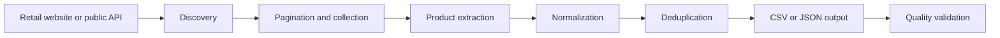

<div align="center">

# Egypt E-commerce Web Scrapers

### Production-minded product data collection for 39 Egyptian retailers

One focused scraper per retailer. One normalized sample schema. Clear setup and maintenance guidance.

[](LICENSE)
[](#scraper-catalog)
[](#technology-stack)
[](#technology-stack)

[](https://github.com/belalhazem511/Ecommerce-Scrapping-Egypt-2026/commits/main)
[](https://github.com/belalhazem511/Ecommerce-Scrapping-Egypt-2026)
[](https://github.com/belalhazem511/Ecommerce-Scrapping-Egypt-2026/stargazers)

[Explore Scrapers](#scraper-catalog) | [Quick Start](#quick-start) | [Data Schema](#normalized-data-contract) | [Technical Documentation](DOCUMENTATION.md)

</div>

---

## Overview

This repository is a curated collection of **39 independent Python and JavaScript web scrapers** for Egyptian retail and e-commerce websites. It covers electronics, grocery, furniture, sports, beauty, pharmacy, toys, stationery, and general marketplaces.

Every retailer folder is intentionally simple:

| Included | Purpose |
|---|---|
| Final scraper | One clear Python or JavaScript entry point |
| Clean sample | Exactly 10 normalized example products |
| Project README | Target-specific setup, usage, quality, and maintenance notes |

Debug scripts, historical versions, full datasets, browser profiles, caches, and generated artifacts are excluded.

## Why this repository?

| Professional structure | Practical coverage | Consistent data |
|---|---|---|
| Isolated retailer projects with clear entry points | Multiple Egyptian retail sectors and extraction strategies | Shared product schema across all 39 samples |
| Source-detected technology and capability documentation | Static HTML, APIs, GraphQL, sitemaps, and rendered pages | Clean prices, URLs, categories, brands, and availability |

### Core features

- **39 retailer-specific scrapers** with direct project links
- **Multiple extraction strategies** for different website architectures
- **Static and dynamic website support** through HTTP clients and browser automation
- **Pagination and product discovery** through categories, search, APIs, and sitemaps
- **Async or concurrent collection** where appropriate for the source
- **Normalized sample data** with the same 10-column contract
- **Data-quality guidance** for price, URL, encoding, and duplicate validation
- **Responsible-use controls** covering rate limits, access restrictions, and secrets
- **Minimal Git history noise** with generated outputs excluded
- **MIT license** for clear reuse terms

## Scraper catalog

Every project name links directly to its folder and professional README.

| Sector | Projects |
|---|---|
| **Electronics & Appliances** | [B.TECH](scrapers/btech) - [Cairo Sales](scrapers/cairosales) - [Compumarts](scrapers/compumarts) - [Dokkan Tech](scrapers/dokkantech) - [Dream 2000](scrapers/dream2000) - [Elfar](scrapers/elfar) - [Elghazawy](scrapers/elghazawy) - [Fresh](scrapers/fresh) - [Raya Shop](scrapers/raya) - [Sigma](scrapers/sigma) - [Tradeline](scrapers/tradeline) - [Unionaire](scrapers/unionaire) |
| **Grocery & Supermarkets** | [Bashrety](scrapers/bashrety) - [CStore](scrapers/cstore) - [Gourmet Egypt](scrapers/gourmet) - [Hyper One](scrapers/hyperone) - [Meercato](scrapers/meercato) - [Metro Markets](scrapers/metro) - [Seoudi](scrapers/seoudi) - [Talabat](scrapers/talabat) |
| **Furniture & Home** | [Ariika](scrapers/ariika) - [Ennap](scrapers/ennap) - [IKEA Egypt](scrapers/ikea) |
| **Beauty & Pharmacy** | [EVA](scrapers/eva) - [Mazaya](scrapers/mazaya) - [Source Beauty](scrapers/sourcebeauty) - [Talabat Pharmacy](scrapers/talabat-pharmacy) - [Talabat Pharmacy - Zamalek](scrapers/talabat-pharmacy-2) - [The Beauty Secrets](scrapers/the-beauty) |
| **Sports** | [Decathlon Egypt](scrapers/decathlon) - [GO Sport](scrapers/gosport) - [Intersport](scrapers/intersport) |
| **Baby & Toys** | [Baby Island](scrapers/baby-island) - [Chicco](scrapers/chicco) - [Top Toys Egypt](scrapers/toptoys) |
| **Stationery** | [Samir & Aly](scrapers/samiraly) |
| **Marketplaces & Discovery** | [Kimo Store](scrapers/kimostore) - [Noon Egypt](scrapers/noon) - [InstaShop Mobile Discovery](scrapers/mobiletest) |

## How it works



The exact path varies by retailer. A scraper may use static HTML, a sitemap, a public API, GraphQL, or a rendered browser session.

## Repository architecture

```text
Ecommerce-Scrapping-Egypt-2026/
|-- scrapers/
|   `-- <retailer>/
|       |-- scraper.py | scraper.js   # Final entry point
|       |-- sample_data.csv           # 10 cleaned products
|       `-- README.md                 # Project documentation
|-- .gitignore
|-- DOCUMENTATION.md                  # Full technical reference
|-- LICENSE                           # MIT License
|-- package.json                      # JavaScript dependencies
|-- requirements.txt                  # Python dependencies
`-- README.md                         # Repository landing page
```

Each retailer project is isolated. There is no global runner and no hidden dependency between scraper folders.

## Technology stack

| Layer | Technologies |
|---|---|
| **Languages** | Python 3.11+, JavaScript, Node.js 20+ |
| **HTTP** | Requests, HTTPX, aiohttp, Axios, Fetch API |
| **Parsing** | Beautiful Soup, lxml, Cheerio |
| **Browser automation** | Playwright, Selenium |
| **Sources** | HTML, REST, GraphQL, XML sitemaps, storefront APIs |
| **Processing** | pandas, CSV, JSON |
| **Concurrency** | asyncio, aiohttp, worker pools |
| **Collaboration** | Git, GitHub, Markdown |

Each project README lists the stack detected in that scraper's current source.

## Quick start

### 1. Clone

```bash
git clone https://github.com/belalhazem511/Ecommerce-Scrapping-Egypt-2026.git
cd Ecommerce-Scrapping-Egypt-2026
```

### 2. Choose your runtime

<details>
<summary><strong>Python setup</strong></summary>

Windows PowerShell:

```powershell
python -m venv .venv
.venv\Scripts\Activate.ps1
python -m pip install --upgrade pip
pip install -r requirements.txt
playwright install chromium
```

macOS or Linux:

```bash
python3 -m venv .venv
source .venv/bin/activate
python -m pip install --upgrade pip
pip install -r requirements.txt
playwright install chromium
```

</details>

<details>
<summary><strong>JavaScript setup</strong></summary>

```bash
npm install
npx playwright install chromium
```

</details>

### 3. Run one project

Python:

```bash
cd scrapers/ariika
python scraper.py
```

JavaScript:

```bash
cd scrapers/dream2000
node scraper.js
```

Read the selected folder's README and inspect its settings before a full run.

## Normalized data contract

Every **sample_data.csv** contains exactly 10 cleaned and unique records:

| Column | Example | Meaning |
|---|---|---|
| `name` | Product name | Clean display name |
| `price` | `499.99` | Current numeric price |
| `old_price` | `599.99` | Previous price, when available |
| `discount` | `16.67` | Source discount value |
| `category` | Electronics | Category or category path |
| `brand` | Brand name | Product manufacturer or brand |
| `url` | `https://...` | Product page |
| `image_url` | `https://...` | Product image |
| `availability` | in_stock | Source stock state |
| `seller` | Retailer | Seller, market, or pharmacy |

Optional values remain blank when the source does not provide reliable data. Samples demonstrate structure; they are not current or complete catalogs.

## Quality standards

Before accepting a scraper output, verify:

- Product names and current prices are present.
- Numeric values use the expected currency and scale.
- Product and image URLs use valid HTTP or HTTPS addresses.
- Old prices and discounts are internally consistent.
- Duplicate products and variants are handled intentionally.
- Arabic and English text remains valid UTF-8.
- Categories, brands, availability, and sellers map to the correct columns.

The complete checklist is available in [DOCUMENTATION.md](DOCUMENTATION.md#9-data-quality-checklist).

## Responsible use

> [!CAUTION]
> This repository does not grant permission to scrape any website.

- Collect only public data you are permitted to access.
- Review website terms and robots policies.
- Keep delays and concurrency at respectful levels.
- Stop on rate-limit or access-denied responses.
- Do not bypass authentication, CAPTCHA, paywalls, or technical restrictions.
- Never commit cookies, credentials, browser profiles, or generated catalogs.

## Documentation

| Resource | Description |
|---|---|
| [Technical documentation](DOCUMENTATION.md) | Architecture, catalog, schema, cleaning, quality, security, and troubleshooting |
| [Project READMEs](scrapers) | Retailer-specific technology, setup, execution, and maintenance |
| [MIT License](LICENSE) | Reuse and distribution terms |

## Support the project

If this collection helps your learning, research, or engineering work:

1. Star the repository.
2. Share it with other data and automation engineers.
3. Report outdated selectors or source changes through GitHub Issues.
4. Keep contributions focused, documented, and respectful of target websites.

<div align="center">

**Built for practical, maintainable e-commerce data collection in Egypt.**

[Back to top](#egypt-e-commerce-web-scrapers)

</div>
